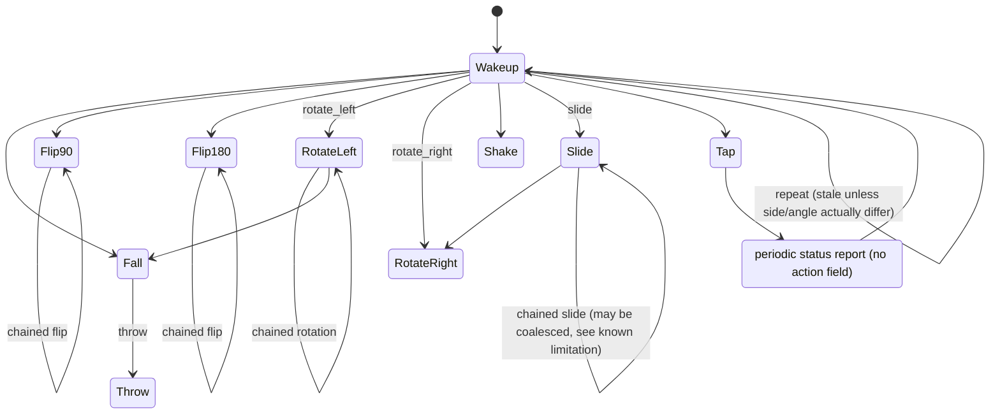

# Aqara Magic Cube (MFKZQ01LM) for Node-RED

Node-RED flows for turning an Aqara Magic Cube (MFKZQ01LM) Zigbee gesture
cube, received via [zigbee2mqtt](https://www.zigbee2mqtt.io/), into either
a generic gesture-router flow or a full HomeKit accessory (10
`StatelessProgrammableSwitch` buttons + `Battery`, via
[NRCHKB](https://github.com/NRCHKB/node-red-contrib-homekit-bridged)).

Built from reverse-engineering the cube's zigbee2mqtt payload shape across
two physical units — gesture detection, a fresh-vs-stale-report fingerprint
(the cube's bridge periodically re-reports the last gesture on heartbeats),
and known limitations are all written up in
[`docs/magic-cube-gesture-reference.md`](docs/magic-cube-gesture-reference.md).

## Prerequisites

- [`node-red-contrib-zigbee2mqtt`](https://flows.nodered.org/node/node-red-contrib-zigbee2mqtt) —
  required for all flows below.
- [`node-red-contrib-homekit-bridged`](https://flows.nodered.org/node/node-red-contrib-homekit-bridged) (NRCHKB) —
  only required for the HomeKit-specific flows (`magic-cube-homekit-parser`,
  `magic-cube-homekit-switches`).

## Flows

| File | Outputs | Use it if... |
|---|---|---|
| [`flows/magic-cube-parser.js`](flows/magic-cube-parser.js) / [`.flow.json`](flows/magic-cube-parser.flow.json) | 3 (gestures / heartbeats / get-snapshots) | You want the raw gesture events and will route them yourself (a `switch` node on `msg.payload.action`, any downstream integration — not just HomeKit). |
| [`flows/magic-cube-homekit-parser.js`](flows/magic-cube-homekit-parser.js) / [`.flow.json`](flows/magic-cube-homekit-parser.flow.json) | 12 (one per gesture, plus side and battery) | You want to wire straight into NRCHKB yourself, with your own accessory layout. |
| [`flows/magic-cube-homekit-switches.flow.json`](flows/magic-cube-homekit-switches.flow.json) | — (complete flow) | You want a ready-to-import, single-cube HomeKit accessory: 10 buttons + battery grouped under one `ServiceLabel`, zigbee2mqtt input included. Import this once per physical cube you own — if you import it more than once, change the `ServiceLabel` node's `serialNo` field on each subsequent import (every copy ships with the same placeholder `MFKZQ01LM-600DB31E`) so each accessory's AccessoryInformation stays distinct. |

**Import:** in the Node-RED editor, Menu → Import → Clipboard, paste the
contents of the `.flow.json` file you want.

After importing `magic-cube-homekit-switches.flow.json`: open the
`zigbee2mqtt-in` and `zigbee2mqtt-get` nodes and point them at your own
cube (the device picker requires an existing `zigbee2mqtt-server` config
node for your broker — not included, since that's specific to your
setup), then open the `ServiceLabel` node ("Magic Cube") and pick your own
`homekit-bridge` config node from the Bridge dropdown. Everything else
(the 10 switches, Battery) inherits the bridge through `parentService` —
only the parent needs it set.

## Gesture transition diagram

Built from real captured transitions — treat as illustrative, not
exhaustive. Full detail, known limitations, and the payload schema are in
[`docs/magic-cube-gesture-reference.md`](docs/magic-cube-gesture-reference.md).

## License

MIT — see [`LICENSE`](LICENSE).
