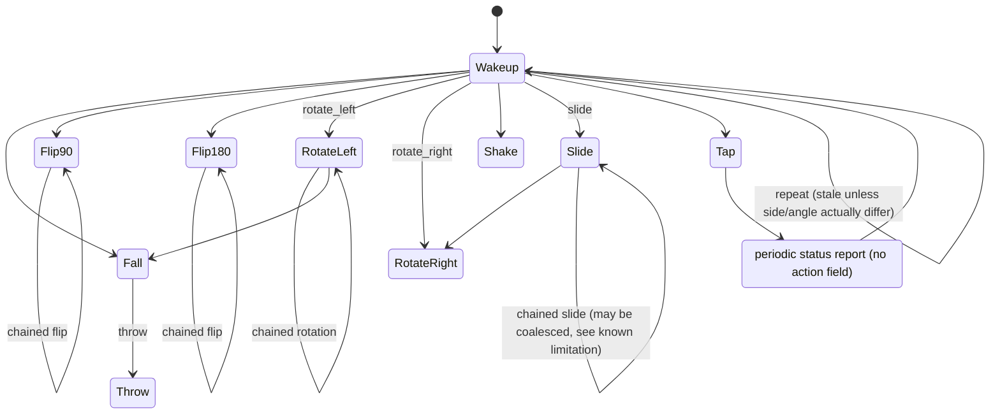

# Aqara Magic Cube (MFKZQ01LM) — Gesture Reference & Node-RED Integration

Based on 21 example zigbee2mqtt state-change traces captured from two cubes (`Cube-A`, `Cube-B`). Written for wiring the cube into Node-RED with `node-red-contrib-zigbee2mqtt` and `node-red-contrib-homekit-bridged`. The raw trace captures themselves are not included in this repo — only this doc's conclusions from them.

Companion files (`magic-cube-parser.js`, `magic-cube-parser.flow.json`, `magic-cube-homekit-parser.js`, `magic-cube-homekit-parser.flow.json`, `magic-cube-homekit-switches.flow.json`) live in [`flows/`](../flows/) in this repo.

## Device identity

Model `MFKZQ01LM` (`lumi.sensor_cube.aqgl01`), vendor Aqara, manufacturer ID 4151 / `LUMI`. Battery-powered end device, no OTA support.

## Payload fields

Every message carries these fields regardless of whether a gesture occurred:

| Field | Type | Notes |
|---|---|---|
| `battery` | % | 100 in all samples |
| `voltage` | mV | battery voltage |
| `device_temperature` | °C | onboard sensor temperature |
| `power_outage_count` | int | increments across power-loss events |
| `linkquality` | 0–255 | zigbee LQI |
| `side` | 0–5 | which face is currently up; persists between messages |
| `angle` | ° | last accelerometer angle reading; persists between messages |
| `elapsed` | ms | device-side counter — **not a reliable freshness signal**, see below |
| `power` | — | present but undocumented upstream; treat as diagnostic only |
| `action` | enum or absent | see next section |

### The `action` field, and heartbeat reports

`action` is only present when the cube has a gesture to report: `wakeup`, `fall`, `tap`, `slide`, `flip180`, `flip90`, `rotate_left`, `rotate_right`, `shake`, `throw`. Periodic full-state reports (battery/link-quality refreshes) omit `action` entirely — confirmed by captured heartbeat traces (not included in this repo), where the "new" state has no `action` key at all even though `side`/`angle` are carried over from the last real gesture. Any action can be followed by a heartbeat, not just `tap` — this isn't specific to one gesture.

**Physical mapping note (confirmed by hands-on testing, not derivable from the payloads themselves):** despite the name, `tap` fires on a physical **double-tap with the cube** (e.g. tapping the cube itself against a surface twice) — not a double-tap on the cube's face with a finger — and a single tap does not produce this action. The z2m expose description ("Triggered action (e.g. a button click)") is generic and doesn't make this clear.

### Gesture-specific extra fields

| Action | Extra fields | Notes |
|---|---|---|
| `rotate_left` / `rotate_right` | `action_angle` (= `angle`) | signed rotation delta in degrees; `side` unchanged |
| `flip90` | `action_from_side`/`from_side`, `action_side`/`side`, `action_to_side`/`to_side` | z2m publishes both a prefixed and unprefixed copy of the same value |
| `flip180` | none beyond `side` | only the resulting `side` is reported, no from/to |
| `wakeup`, `tap`, `shake`, `slide`, `fall`, `throw` | none | just `side`/`angle` as context |

## The `changed.old` / `changed.new` envelope

Each trace's `changed` object holds the device's full state immediately before this message (`old`) and what this message is actually reporting (`new`, equivalent to `payload`). If a device has no prior recorded state at all, `old` is `null` — confirmed by a captured trace (not included in this repo): the very first message ever seen from `Cube-B`, with `old: null` and a `new` that has no `action` key at all (a heartbeat, not a gesture). A `new` with no `action` key is a status/heartbeat report; a `new` with an `action` key is a candidate gesture, subject to the fingerprint check below.

## The "get" node's response (a third message shape)

A captured trace (not included in this repo) shows what comes out of node-red-contrib-zigbee2mqtt's **get** node when it's manually triggered (fed any input message to force it to report current state). It's structurally close to a live event — same `payload`/`changed`/`item` envelope — but two things mark it as different:

- `msg.payload_in` is present, carrying whatever triggered the get request (`{"foo": "bar"}` in the example — the trigger payload's content doesn't matter, only its presence as `payload_in` does).
- `changed.old` and `changed.new` are **byte-identical**, down to `elapsed` matching exactly (6181 in both). Nothing actually changed — this is just the cube's last known cached state being read back on demand, not a new report from the device.

`magic-cube-parser.js` now checks `msg.payload_in` first, before any gesture/heartbeat logic runs, and routes it to a third output as a plain state snapshot — never counted as a fresh gesture, and never allowed to touch the freshness-tracking context that live messages use. It's safe to wire the get node's output into the same parser alongside your live `zigbee2mqtt-in` feed.

## The "fresh vs. stale" problem (corrected, then debounced)

**Update:** an earlier version of this doc/parser used `elapsed` (assuming it resets low on a genuinely new gesture) to tell a fresh gesture apart from a stale re-report. Two captured traces (not included in this repo) disprove that: one shows two real, distinct flips (from_side/side/to_side genuinely change: 1→3→3, then 3→4→4) where `elapsed` *increases* (2184 → 5886) — the opposite of what the old rule expected. So `elapsed` on its own tells you nothing reliable about freshness; it looks like real time between messages, which can go up or down for entirely legitimate reasons.

**What `elapsed` actually tracks:** it's the device's own real-time counter of milliseconds since its *previous* transmission of any kind — not since the last matching gesture, not since a wakeup, just since the last time it said anything at all. It's tempting to guess it resets specifically on a `wakeup` event, since captured traces right after one consistently show small `elapsed` values (picking up the cube fires `wakeup`, then the intended gesture follows within 1-13 seconds in real life). But that doesn't hold up: a captured wakeup-to-wakeup repeat (not included in this repo) does NOT reset to near-zero (1,239,394ms → 170,010ms, nowhere near the sub-13-second range of the other cases), while other captured transitions with **no wakeup anywhere near them** show the exact same kind of large drop (12,819 → 880, and 23,639 → 5,207). The pattern is simply real inter-message timing, independent of what either message's `action` was.

A message can also repeat the last `action` verbatim with **no other field changed** (confirmed by captured traces, not included in this repo — both `wakeup` → `wakeup` with identical `side`/`angle`). **Root cause, traced to zigbee2mqtt's own source (v2.14.1):** this is NOT the bridge injecting a stale cached `action` into an unrelated heartbeat — zigbee2mqtt's state cache (`dist/state.js`) explicitly excludes `action` and related fields (`CACHE_IGNORE_PROPERTIES`) from what it carries forward between messages, confirmed both in source and in live captured heartbeat payloads (heartbeats never carry `action` at all). A message that DOES carry a repeated `action` is therefore a genuine second Zigbee attribute report from the device itself — most plausibly an ordinary Zigbee delivery retry (a missed ACK causing a near-immediate retransmission of the same report), given the device's `quirkCheckinInterval("1_HOUR")` extend governs only its unrelated end-device poll cadence, not gesture reporting.

So the reliable signal isn't `elapsed`, it's whether anything that actually carries the gesture's meaning changed:

- `flip90`: `side` + `from_side` + `to_side`
- `flip180`: `side`
- `rotate_left` / `rotate_right`: `action_angle`
- everything else (`wakeup`, `tap`, `shake`, `slide`, `fall`, `throw`): `side` + `angle`

**Arrival-time debounce (current behavior, opt-in):** a message is a new gesture when the `action` changes, that action's fingerprint changes, OR enough real time (`MIN_REFIRE_INTERVAL_MS`, 1 second by default) has passed since the last *fired* gesture for that device — tracked via `Date.now()` in Node-RED when the message arrives, never via the payload's own `elapsed`. Same action + same fingerprint + within the window = still treated as a stale duplicate (most plausibly the Zigbee retry case above) and dropped. Same action + same fingerprint + past the window = treated as a genuine repeat and fired. Both `magic-cube-parser.js` and `magic-cube-homekit-parser.js` implement this identically.

This was empirically validated two ways: four real, consecutive `shake` captures (not included in this repo) all share byte-identical `action`/`side`/`angle` and are spaced 2-16 seconds apart — confirming genuine repeats of a non-positional gesture really do produce identical fingerprints, and that they land comfortably outside a 1-second window. And the wakeup-repeat trace's own gap is far larger than 1 second, so under the debounce it now correctly fires twice instead of being coalesced.

**This suppression is opt-in, off by default.** A second constant, `SUPPRESS_STALE_ACTIONS`, defaults to `false` — out of the box, every action-bearing message fires immediately, with no fingerprint or debounce filtering at all. Set it `true` if you'd rather have suppression (e.g. because you're seeing duplicate HomeKit button presses from ordinary Zigbee delivery retries).

**Known limitation, narrowed but not eliminated (when suppression is enabled):** a captured trace (not included in this repo) shows a real slide-away-and-back — two genuine, separate physical slides that happen to start and end on the same side, byte-identical `side`/`angle` in `old` and `new`. These are still coalesced into one event when landing inside the debounce window, the same way they always were. This affects any non-positional or side-preserving gesture (`tap`, `shake`, `slide`, `fall`, `throw`, and even `flip180` if it happens to land back on the same side) whenever two real occurrences share the same fingerprint AND happen inside `MIN_REFIRE_INTERVAL_MS` of each other. If you need to catch those too, either lower the constant (trading off against tolerance for genuine Zigbee delivery retries, which this window exists to filter) or add a coarser debounce of your own further downstream.

## Gesture transition diagram

Built from the captured trace set (not included in this repo) — only the transitions actually captured in the sample set. Treat this as illustrative, not exhaustive: with `flip90`, `flip180`, and `rotate_left` now all confirmed to chain into themselves, it's likely most gestures can follow most others.



## Node-RED integration

Files:

- `magic-cube-parser.js` — the Function-node body described above (3 outputs: gestures / heartbeats / get-snapshots).
- `magic-cube-parser.flow.json` — the same code pre-wrapped as an importable Node-RED Function node (Menu → Import → Clipboard, in the Node-RED editor).
- `magic-cube-homekit-parser.js` / `magic-cube-homekit-parser.flow.json` — a HomeKit-direct variant with 12 outputs (one per gesture, plus side and battery), for wiring straight into `node-red-contrib-homekit-bridged` — see "HomeKit-direct variant" below.
- `magic-cube-homekit-switches.flow.json` — the turnkey version: the same parser already wired to 10 `StatelessProgrammableSwitch` accessory nodes, one per gesture, plus the physical zigbee2mqtt input source that feeds it — see "Turnkey flow" below.

Wire it directly after your `zigbee2mqtt-in` node (node-red-contrib-zigbee2mqtt) for the cube — the get node's response can feed the same input:

```
[zigbee2mqtt-in: cube] ─┐
[zigbee2mqtt-get: cube] ┴→ [Parse Magic Cube Gesture] → output 1: gesture events
                                                       → output 2: heartbeat/status reports
                                                       → output 3: get-request snapshots
```

Output 1 fires only on genuinely new gestures, normalized to e.g.:

```json
{
  "device": "0x00158d0000000000",
  "action": "flip90",
  "side": 4,
  "angle": -4.48,
  "from_side": 3,
  "to_side": 4,
  "elapsed_ms": 5886,
  "battery": 100,
  "voltage": 3105,
  "linkquality": 152,
  "timestamp": 1757455200000
}
```

From there, a `switch` node on `msg.payload.action` is the natural way to branch into your `node-red-contrib-homekit-bridged` accessories — e.g. drive a Stateless Programmable Switch's `ProgrammableSwitchEvent` per gesture, or use `side` to pick a scene. See "HomeKit-direct variant" below for a ready-made 12-output parser that drives `node-red-contrib-homekit-bridged` StatelessProgrammableSwitch and Battery services directly, with no `switch` node needed.

## HomeKit-direct variant: `magic-cube-homekit-parser.js`

A second Function node, `magic-cube-homekit-parser.js` (and its importable
`magic-cube-homekit-parser.flow.json`), sits alongside `magic-cube-parser.js`
rather than replacing it — use this one when you want the cube wired
straight into `node-red-contrib-homekit-bridged` (NRCHKB) with no `switch`
node or extra glue logic in between. It shares the same input contract
(live `zigbee2mqtt-in` events, heartbeats, and `zigbee2mqtt-get` responses
carrying `msg.payload_in`) and the same fingerprint-based freshness check
described above, but fans out to **12 outputs** instead of 3:

| # | Output | Fires on | Shape |
|---|---|---|---|
| 1 | `wakeup` | fresh `wakeup` gesture — leads since it's the cube's initial/resting gesture | `{ ProgrammableSwitchEvent: 0 }` |
| 2 | `fall` | fresh `fall` gesture — outputs 2-10 are alphabetical, no other ordering was more meaningful | `{ ProgrammableSwitchEvent: 0 }` |
| 3 | `flip180` | fresh `flip180` gesture | `{ ProgrammableSwitchEvent: 0 }` |
| 4 | `flip90` | fresh `flip90` gesture | `{ ProgrammableSwitchEvent: 0 }` |
| 5 | `rotate_left` | fresh `rotate_left` gesture | `{ ProgrammableSwitchEvent: 0 }` |
| 6 | `rotate_right` | fresh `rotate_right` gesture | `{ ProgrammableSwitchEvent: 0 }` |
| 7 | `shake` | fresh `shake` gesture | `{ ProgrammableSwitchEvent: 0 }` |
| 8 | `slide` | fresh `slide` gesture | `{ ProgrammableSwitchEvent: 0 }` |
| 9 | `tap` | fresh `tap` gesture (physically a double-tap, see above) | `{ ProgrammableSwitchEvent: 0 }` |
| 10 | `throw` | fresh `throw` gesture | `{ ProgrammableSwitchEvent: 0 }` |
| 11 | `side` | the resting side (`side`) changes — live message or get response | `{ side: 0-5 }` |
| 12 | `battery` | reported `battery` % changes — live message or get response | `{ BatteryLevel, ChargingState, StatusLowBattery }` |

Wiring:

```
[zigbee2mqtt-in: cube] ─┐
[zigbee2mqtt-get: cube] ┴→ [Magic Cube -> HomeKit] → 1 wakeup       → StatelessProgrammableSwitch
                                                    → 2 fall         → StatelessProgrammableSwitch
                                                    → 3 flip180      → StatelessProgrammableSwitch
                                                    → 4 flip90       → StatelessProgrammableSwitch
                                                    → 5 rotate_left  → StatelessProgrammableSwitch
                                                    → 6 rotate_right → StatelessProgrammableSwitch
                                                    → 7 shake        → StatelessProgrammableSwitch
                                                    → 8 slide        → StatelessProgrammableSwitch
                                                    → 9 tap          → StatelessProgrammableSwitch
                                                    → 10 throw       → StatelessProgrammableSwitch
                                                    → 11 side        → (wherever "which face is up" is useful)
                                                    → 12 battery     → NRCHKB Battery (linked service)
```

Outputs 1-10 each wire straight to their own `StatelessProgrammableSwitch`
node — ten independent HomeKit buttons, automatable individually in the
Home app, with no Function node needed in between. Every event defaults to
`ProgrammableSwitchEvent: 0` (single press), since each gesture is already
its own distinct switch; edit the literal for a given action in the code if
you'd rather encode e.g. `tap` as a double-press (`1`) on a shared switch
instead. Payload shapes and characteristic names come from NRCHKB's own
docs: [Stateless Programmable Switch](https://nrchkb.github.io/wiki/service/stateless-programmable-switch/),
[ProgrammableSwitchEvent](https://nrchkb.github.io/wiki/characteristic/programmable-switch-event/),
[Battery](https://nrchkb.github.io/wiki/service/battery/).

The battery output reports `ChargingState: 2` ("not chargeable") always,
since the cube runs on a single non-rechargeable coin cell, and sets
`StatusLowBattery: 1` at or below a 20%-battery threshold (a constant near
the top of the file — z2m/NRCHKB don't define this threshold themselves,
so it's this parser's own choice; tune it if you want an earlier/later
warning in the Home app).

Side and battery outputs are deduplicated on value change rather than
firing on every message (they'd otherwise repeat on every heartbeat), and
both fire from `get`-node responses as well as live messages, since a get
response is still a legitimate readout of current state — unlike outputs
1-10, which a get response never fires (it's a cached-state query, not a
new physical gesture).

## Turnkey flow: `magic-cube-homekit-switches.flow.json`

A complete, ready-to-import flow that bundles `magic-cube-homekit-parser.js`
with the full HomeKit accessory structure, grouped under one `ServiceLabel`
parent rather than 10 independent accessories:

- **`Magic Cube: Input` (`link in`)** — the flow's entry point. Rather than wiring your `zigbee2mqtt-in` / `zigbee2mqtt-get` nodes directly into this flow, pair a `link out` (or `link call`) node right after them — anywhere in your flow, even a different tab — and point it at `Magic Cube: Input` by name. This flow then needs no incoming wire crossing in from elsewhere, the same idea as `Magic Cube: Side` below, just mirrored for the input side. Both link nodes are also set to display their label on the canvas (the serialized flag is `"l": true` on the node -- an explicit `name` alone is *not* enough, Node-RED still defaults link-node labels to hidden; confirmed against a live export from the Node-RED editor after manually toggling "Show Label" on both nodes there).
- **`ServiceLabel` node** ("Magic Cube") — the parent accessory. `isParent: true`, `characteristicProperties` sets `ServiceLabelNamespace: 1` (arabic numerals in the Home app, e.g. "Magic Cube Button 3" — set it to `0` instead if you'd rather have dots). Also carries the accessory's AccessoryInformation: `manufacturer: "Aqara"`, `model: "Magic Cube (MFKZQ01LM)"`, and a generated `serialNo` (`MFKZQ01LM-600DB31E` — arbitrary, since z2m/the cube itself don't expose a real serial number; edit freely). These are dedicated top-level fields on the node, not part of `characteristicProperties` -- confirmed against NRCHKB's own multi-button example, which shows the same `manufacturer`/`model`/`serialNo` shape on the parent node. Only the parent needs them: all 10 switches and Battery share one accessory (and therefore one AccessoryInformation) through `parentService`.
- **10 linked `StatelessProgrammableSwitch` children** — `isParent: false`, `parentService` pointing at the `ServiceLabel` node's id, each with its own `ServiceLabelIndex` (1-10, matching output order: `wakeup`, `fall`, `flip180`, `flip90`, `rotate_left`, `rotate_right`, `shake`, `slide`, `tap`, `throw`) so the Home app numbers them correctly.
- **1 linked `Battery` child** — same `parentService`, fed by output 12 (`battery`), shaped exactly as described in the "HomeKit-direct variant" section above.
- **`side` (output 11)** — goes to a Node-RED core `link out` node ("Magic Cube: Side") instead of anything HomeKit-specific. There's no single obvious HomeKit characteristic for "which face is up", so this is left as an open wiring point rather than a forced decision: drop a `link in` node anywhere in your flow (even a different tab), point it at this link-out, and you're reading live side changes with no edits needed here. (A plain `debug` node was the other option we considered — simpler, but meant for temporary visibility rather than a stable extension point, so `link out` won.)

All 12 `homekit-service` nodes carry `outputs: 2` with two empty wire arrays, matching the real NRCHKB node type's default shape (confirmed the same way, against a live export) rather than the single output this flow originally shipped with -- the second output isn't used by anything here, but leaving it off caused the node's actual shape to disagree with what Node-RED itself creates.

All 12 `homekit-service` nodes (the `ServiceLabel` parent, its 10 switch
children, and Battery) are wrapped in a Node-RED canvas **group**
("Magic Cube (HomeKit Accessory)") — purely a visual/editor convenience
(drag, move, or collapse them as one block), unrelated to the HomeKit-level
`ServiceLabel` grouping above and with no effect on message routing. That
group then sits nested inside a second, outer canvas group ("Magic Cube ->
ServiceLabel accessory (10 switches + Battery, grouped)") that also wraps
both comments, the `Magic Cube -> HomeKit` Function node, and both link
nodes -- so the whole flow (entry point, parser, accessory group, and the
open `side` extension point) moves and collapses as a single block on the
canvas. Both groupings are canvas-only (a node's `g` property pointing at
its group's id); neither has any effect on message routing.

Grouping everything under one `ServiceLabel` parent has a real practical
benefit over the earlier one-accessory-per-switch layout: **only one**
`bridge` field needs setting after import, not ten. Import via Menu ->
Import -> Clipboard, open the "Magic Cube" `ServiceLabel` node, and pick
your existing `homekit-bridge` config node from the "Bridge" dropdown —
the 10 switches and Battery inherit it through `parentService`, they don't
have a `bridge` field of their own.

Field names above (`isParent`, `parentService`, `bridge`, `serviceName`,
`ServiceLabelIndex`, `ServiceLabelNamespace`) come from NRCHKB's own
multi-button example, not guessed: [Example Stateless Programmable Switch](https://github.com/NRCHKB/node-red-contrib-homekit-bridged/wiki/Example-Stateless-Programmable-Switch).

### Physical input: zigbee2mqtt-in / zigbee2mqtt-get / inject

The flow also ships its own physical input source, grouped under
"Magic Cube: Physical Input (zigbee2mqtt)":

- **`zigbee2mqtt-in`** — live state-change events for the cube. `friendly_name` and
  `device_id` ship blank — after import, open this node and pick your own cube from
  the device picker.
- **`zigbee2mqtt-get`** — a manual state pull, wired from an **`inject`** node
  (`payload: {"foo":"bar"}`, matching the trigger shape described earlier in
  "The 'get' node's response") so you can force a fresh snapshot on demand
  (e.g. after a Node-RED restart, before the cube's next physical gesture) instead
  of waiting for the next live event. Same as `zigbee2mqtt-in`, point it at your own
  device after import.
- Both feed a **`link out`** node named `Magic Cube: Input` — matched by name to
  the `Magic Cube: Input` `link in` at the parser's entry point described above, so
  no explicit wire crosses the group boundary.
- Neither node ships with a `zigbee2mqtt-server` config node attached. That config
  node carries your MQTT broker's host and credentials, so it's deliberately left
  for you to select an existing one (or create a new one) after import, rather than
  bundled into this file.

Together with the parser and accessory group already described, this makes the
flow genuinely end-to-end on import: physical zigbee2mqtt input in, HomeKit
accessories out, with only the bridge dropdown and (if reusing this file for a
different device) the zigbee2mqtt server/device fields left to set.

## Reference: Home Assistant blueprint comparison

`golles/Home-Assistant-Config`'s `zigbee2mqtt_aqara_magic_cube.yaml` blueprint (Home Assistant, not Node-RED, but same device/bridge family) independently confirms several things in this doc:

- It triggers on `fall`, `flip180`, `flip90`, `rotate_left`, `rotate_right`, `shake`, `slide`, `tap` — no separate `wakeup` or `throw` handling, treating `wakeup` as a non-actionable precursor and not distinguishing `throw` from `fall`.
- It explicitly notes the same two limitations this doc calls out: flip90 vs flip180 can't be told apart by side alone (it tracks only the resulting side, not the from/to), and fall/shake don't carry a reliable side.
- It branches per `action` and then per current `side` (0–5) via a separate side sensor entity, mirroring the `side`-based dispatch this doc recommends for a Node-RED `switch` node feeding `node-red-contrib-homekit-bridged`.

## Caveats

- Only two devices and 21 traces informed this reference; side numbering (0–5) is almost certainly cube-specific/calibration-dependent, not a fixed physical labeling.
- The `power` field's meaning is undocumented upstream; not used in the parser.
- `flip90`/`flip180` `side` values assume the cube is resting on a flat surface — behavior mid-air (`throw`, `fall`) is less deterministic.
- The dedup fingerprint approach won't distinguish two genuinely identical repeats of a non-positional gesture (confirmed — see the slide-away-and-back trace discussed above).
